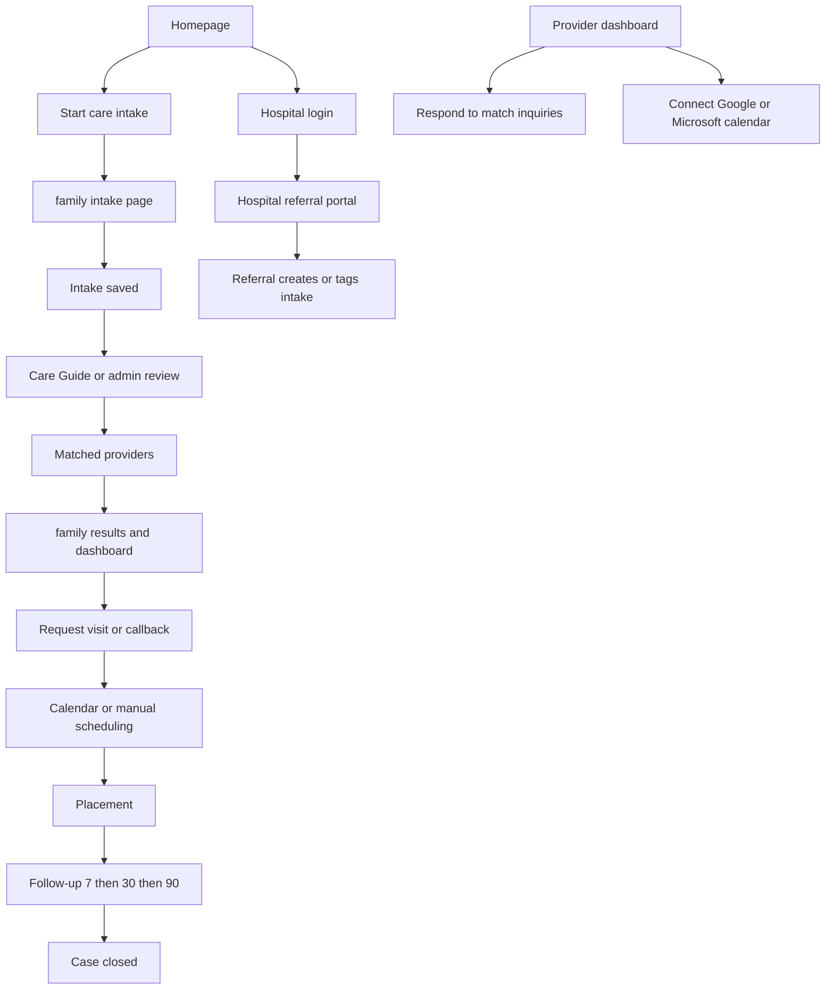
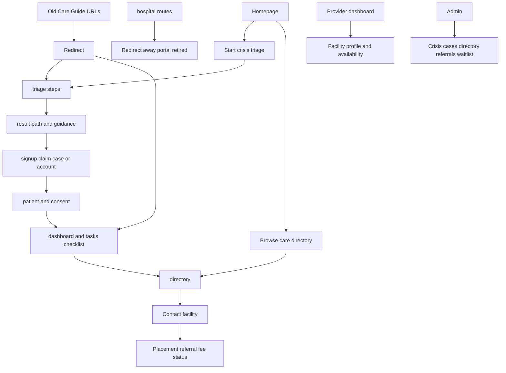
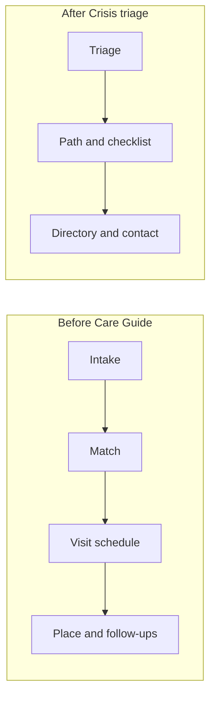

# Shepherds Oud Care — product cutover brief (for review & testing)

**Purpose:** Align on what changed, how the site works now vs before, and give a practical checklist so you can verify the build matches the intended product.

**Audience:** Product owner / client review  
**Status:** Crisis triage is the live family product. Care Guide intake/match/hospital flows have been removed.

> **How to test the live product:** set `PRELAUNCH=false` (or `NEXT_PUBLIC_PRELAUNCH=false`).  
> If prelaunch is still `true`, the public site stays waitlist-only and family flows redirect away from triage.

---

## 1. Product intent (what we aligned to)

| Area | Intended direction | What shipped |
|------|--------------------|--------------|
| Family product | Self-serve **crisis triage** (not guided Care Guide matching) | Primary CTAs go to `/triage/1` |
| Journey | Triage → path/result → checklist → optional account → directory | Live routes below |
| Care Guide | Retire family intake / matching / visit scheduling as the main product | UI + APIs + DB models removed |
| Hospital portal | Not needed for this product | `/hospital/*` redirects home / login |
| Providers | Facility profile dashboard (no calendar booking for Care Guide visits) | Profile/availability remain; calendar booking removed |
| Admin | Ops around crisis cases, directory, referrals, waitlist | Care Guide case/invite panels removed |

---

## 2. Before vs after (plain language)

### Before — Care Guide product

Families filled a long **care intake**. An advisor/Care Guide path led to **matched providers**, **visit/callback scheduling** (including calendar), placement, and **7 / 30 / 90 follow-ups**. Hospitals could use a **referral portal**. Providers saw **family inquiries** from matches.

### After — Crisis triage product

Families start with a short **crisis triage**. They get a **recommended path**, a **checklist of next steps**, can **create/claim an account**, manage **patient/consent**, and **browse the Haaglanden directory** (with partner success-fee tracking on contacts). There is **no** Care Guide intake, automatic provider matching, visit calendar, hospital portal, or 7/30/90 follow-up journey in the product.

---

## 3. Site flowcharts

### Before — Care Guide (retired)

### After — Crisis triage (current)

### Side-by-side summary

---

## 4. What changed technically (for confidence, not for day-to-day testing)

**Removed from the product**

- Family Care Guide UI (intake form, results, active matches, journey timeline, etc.)
- Hospital invite / referral portal
- Intake & match APIs
- Provider calendar connect + visit slot booking
- Scheduling-expiry cron
- Database models: Intake, Match, Hospital, calendar booking tables; `HOSPITAL` role remounted to `FAMILY`

**Still in the product**

- Crisis triage, result, signup, patient, dashboard, tasks
- Haaglanden directory + partner referrals
- Provider facility dashboard
- Admin ops (cases, directory, referrals, waitlist, announcements)
- Waitlist / prelaunch mode when enabled
- Auth (family magic link, provider, admin Google)

**Legacy URLs (should redirect, not 404)**

| Old path | Should land on |
|----------|----------------|
| `/family/intake` | `/triage/1` |
| `/family/results`, `/family/success` | `/result` |
| `/family/dashboard` | `/dashboard` |
| `/v2/*` | same path without `/v2` |
| `/hospital`, `/hospital/login` | `/` or `/login` |

---

## 5. Suggested test plan (please tick while reviewing)

### A. Public / family (with prelaunch **off**)

- [ ] Homepage primary CTA starts **crisis triage** (not “start care intake” / matching language)
- [ ] Completing triage reaches a clear **result / path** page
- [ ] Guidance does **not** claim DigiD / CIZ / gemeente filing on the family’s behalf
- [ ] Signup can claim/create the case
- [ ] Patient + consent steps work
- [ ] Dashboard / tasks show a usable checklist
- [ ] Directory loads and facility contact works
- [ ] Success-fee disclosure appears where a facility is contacted
- [ ] Old bookmarks (`/family/intake`, `/v2/...`) redirect sensibly

### B. Should **not** appear anymore

- [ ] No hospital referral portal or invite flow
- [ ] No Care Guide match shortlist / request visit calendar UI
- [ ] No 7 / 30 / 90 follow-up journey as the main product story
- [ ] Provider dashboard has no “connect calendar for visit booking”

### C. Provider & admin

- [ ] Provider can sign in and edit facility profile
- [ ] Admin can open crisis cases / directory / referrals / waitlist tools that still apply
- [ ] No “invite hospital” admin panel

### D. Language & trust

- [ ] NL and EN both make sense on triage, result, tasks, directory
- [ ] Branding and tone feel like crisis support + directory, not guided matching agency copy leftovers

---

## 6. Open items still for client sign-off

These are product/legal/content items, not “is the old Care Guide still live?”:

- [ ] Haaglanden directory content beyond demo rows
- [ ] Checklist template URLs / content signed off
- [ ] DPIA / consent / retention legal checklist (see `docs/CRISIS_V2_LAUNCH_CHECKLIST.md`)

---

## 7. How to reply after review

Please note anything that feels **misaligned** as:

1. **Must fix before go-live**  
2. **Nice to have later**  
3. **Confirmed OK**

If something in the “before” product was still required (e.g. hospital referrals or Care Guide matching), call that out explicitly so we can decide whether to restore or redesign — those pieces are intentionally gone in this cutover.
