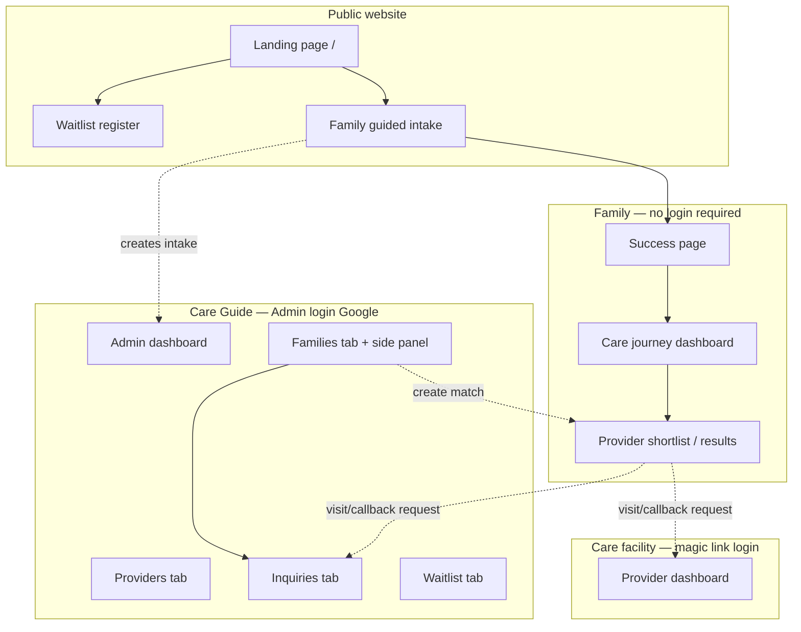
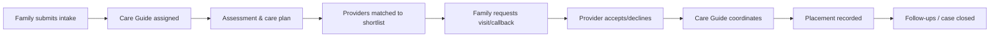
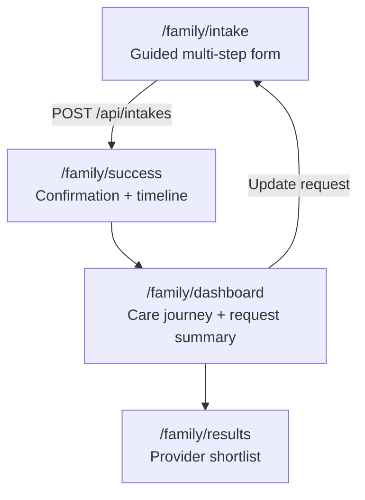
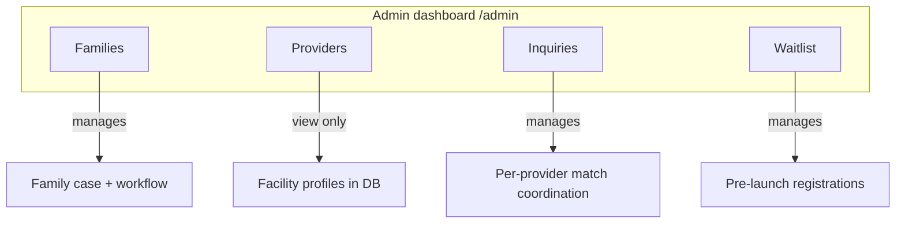
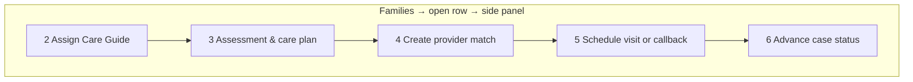
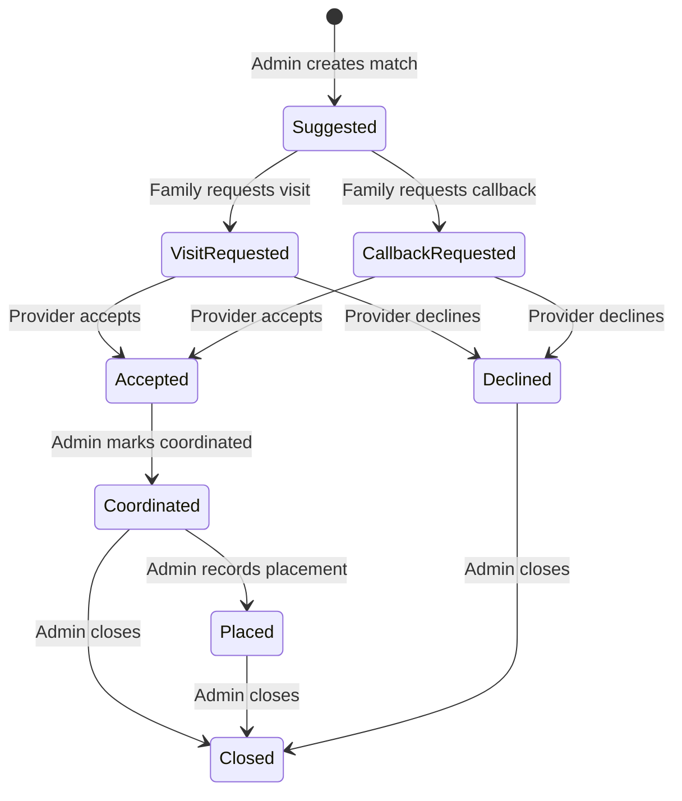
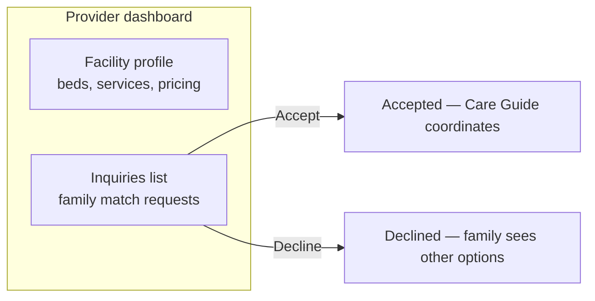
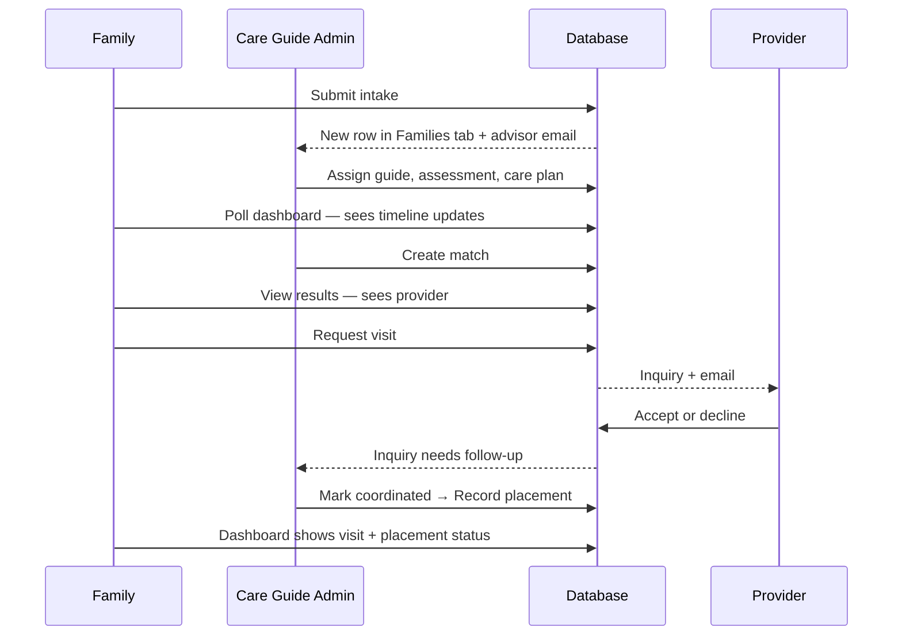

# Shepherds Oud — End-to-End Platform Flow

**Purpose:** Client verification document. Describes how the live platform works today — who does what, in which screen, and how data moves between family, Care Guide (admin), and provider.

**Production mode:** `NEXT_PUBLIC_PRELAUNCH=false` (guided intake, dashboard, matches live)  
**Prelaunch mode:** Waitlist only; family intake paths redirect to register/waitlist

---

## 1. Who uses the platform

| Role | How they sign in | Main job |
|------|------------------|----------|
| **Family** | No account — browser remembers their intake on this device | Submit care request, follow journey, review matched providers, request visits/callbacks |
| **Care Guide (Admin)** | Google sign-in (`ADMIN_EMAILS`) | Review intakes, assign guide, assessment & care plan, create matches, coordinate visits, record placement |
| **Provider** | Email magic link (`PROVIDER_EMAILS` + linked facility) | Update facility profile, accept/decline family visit or callback requests |
| **Waitlist visitor** | No account | Pre-launch registration (family or facility interest) |

---

## 2. High-level journey (one family case)

**Guiding principle:** Shared decisions with a real Care Guide — not a self-serve directory. Families see updates on their **dashboard timeline**; email is used only for key milestones (see §8).

---

## 3. Public website

| Page | URL | What happens |
|------|-----|--------------|
| Landing | `/` | Marketing, CTAs to intake or waitlist |
| Family waitlist | `/register/family` | Pre-launch family interest form |
| Facility waitlist | `/register/facility` | Pre-launch provider/facility interest |
| Waitlist success | `/register/success` | Confirmation after waitlist signup |
| Admin login | `/login` | Google OAuth for Care Guides |
| Provider login | `/provider/login` | Magic link for facility staff |

---

## 4. Family module (no login)

### 4.1 Pages

| Page | What the family sees | Data source |
|------|----------------------|-------------|
| **Intake** | Step-by-step form (contact, care needs, urgency, etc.) | Submitted → saved to database + device storage |
| **Success** | “We received your request”, reference number, journey timeline | Syncs latest status from API |
| **Dashboard** | Full timeline, care request summary, Care Guide updates (pathway, plan, visit), link to matches | Refreshes from API on load / refresh button |
| **Results** | Matched providers (score, details), request visit or callback per provider | Matches from API when status allows |

**Device note:** Family progress is tied to the browser that submitted the intake (`localStorage`). Same intake ID is used to fetch live updates from the server.

### 4.2 Family journey timeline (case status)

These steps appear on **Success**, **Dashboard**, and drive what the family sees:

| Step | Status | Family-visible meaning |
|------|--------|------------------------|
| 1 | Request received | Intake submitted |
| 2 | Care Guide assigned | Named guide reviewing the case |
| 3 | Assessment | Guide learning about needs |
| 4 | Care plan | Pathway + plan summary on dashboard |
| 5 | Providers matched | Shortlist available on Results page |
| 6 | Visit scheduled | Visit/callback date shown on dashboard |
| 7 | Provider response | A provider accepted or responded |
| 8 | Placement in progress | Moving toward admission |
| 9 | Care arranged | Placement secured |
| 10–12 | 7 / 30 / 90-day follow-up | Post-placement check-ins |
| — | Case closed | Journey complete |

### 4.3 Family actions on provider shortlist

| Action | When available | Effect |
|--------|----------------|--------|
| **Request visit** | Match status = Suggested | Match → Visit requested; provider emailed; appears in Admin **Inquiries** |
| **Request callback** | Match status = Suggested | Match → Callback requested; provider emailed; appears in Admin **Inquiries** |
| View status hints | After request | Dashboard/results show next-step messaging |

---

## 5. Admin module (Care Guide dashboard)

**URL:** `/admin` (requires Google admin login)

### 5.1 Four tabs — overview

| Tab | One-line purpose | Opens |
|-----|------------------|--------|
| **Families** | Run the **whole case** for each family | Side panel: workflow steps 2–6 |
| **Providers** | **View** facility records (contact, beds, services) | Read-only side panel |
| **Inquiries** | **Coordinate** each family↔provider match after shortlist activity | Side panel: mark coordinated / placement / close |
| **Waitlist** | **Review** pre-launch sign-ups | Mark contacted |

---

### 5.2 Families tab — side panel workflow

**Job:** Move one family from “new intake” to “care arranged”.

| Step | Admin action | Updates family dashboard |
|------|--------------|---------------------------|
| **2. Assign Care Guide** | Select guide → Assign | Timeline: Care Guide assigned; guide name/email shown |
| **3. Assessment & care plan** | Pathway + internal notes + **care plan summary** → **Save & share with family** | Timeline: Assessment / Care plan; pathway + plan on dashboard |
| | Optional: **Mark shortlist ready** | Timeline: Providers matched; Results page unlocks |
| **4. Create provider match** | Pick provider, score %, notes → Create match | Provider appears on family **Results** (form fields stay filled for next match) |
| **5. Schedule visit** | Date, type, provider name, notes → Save | Visit block on dashboard; timeline → Visit scheduled *(only if case not already past that stage)* |
| **6. Advance status** | Buttons for next legal step (e.g. placement in progress, follow-ups, close) | Timeline advances per status rules |

**Collapsed section:** Intake details (read-only submission data).

**Top of panel:** Case status, Care Guide name, journey step indicator.

---

### 5.3 Providers tab

**Job:** Reference directory of care facilities in the database.

- Table: name, type, area, beds open  
- Side panel: contact, location, capacity, pricing, services, languages — **view only**  
- Providers are **not created here**; they exist in the database (seeded or migrated)

*Use case:* Care Guide looks up facility details while matching or coordinating.

---

### 5.4 Inquiries tab

**Job:** Operational inbox for **one match** (one family + one provider).

**A row appears when:** Admin created a match (Families step 4) and/or family requested visit/callback.

| Match status | Who acts next | Admin action in panel |
|--------------|---------------|------------------------|
| Suggested | Family | Wait for visit/callback request |
| Visit / Callback requested | Provider | Wait for accept/decline (row highlighted) |
| Provider accepted | **Care Guide** | **Mark coordinated** (after arranging call/visit) |
| Coordinated | **Care Guide** | **Record placement** or **Close inquiry** |
| Provider declined | **Care Guide** | Offer another match (Families tab) or close |
| Placed / Closed | — | Archive / done |

**Side panel shows:** Family contact, care needs, provider name, match score, activity log.

**Link to Families tab:** When provider accepts/declines, family **case** may auto-move to **Provider response** on the intake timeline.

---

### 5.5 Waitlist tab

**Job:** Handle pre-launch registrations before full intake is open.

| Column | Meaning |
|--------|---------|
| Type | FAMILY or FACILITY |
| Contact, location, message | Submission details |
| Status | NEW → CONTACTED |

**Action:** Mark contacted when Care Guide has reached out.

---

## 6. Provider module

**URL:** `/provider` (magic link login)

### 6.1 Two main areas

| Section | Job |
|---------|-----|
| **Profile** | Keep facility information accurate (beds, care levels, visit availability, etc.) |
| **Inquiries** | Respond to **visit requested** or **callback requested** matches |

| Provider action | Result |
|-----------------|--------|
| **Accept** | Match → Accepted; family sees update; Care Guide notified via Inquiries tab |
| **Decline** | Match → Declined; family can view other providers |

Provider does **not** change the family case timeline directly — only the **match** row. Admin coordinates next steps.

---

## 7. How the three modules connect

| Data object | Created by | Used in |
|-------------|------------|---------|
| **Intake** (family case) | Family form | Families tab, family dashboard |
| **Match** (family + provider) | Admin “Create match” | Results page, Inquiries tab, provider dashboard |
| **Waitlist entry** | Public register form | Waitlist tab |
| **Provider record** | Database / seed | Providers tab, matching, provider dashboard |

---

## 8. Email notifications (milestone policy)

| Event | Who receives email |
|-------|-------------------|
| Family submits intake | Family (confirmation) + Advisor (new intake alert) |
| Family joins waitlist | Registrant (confirmation) |
| Case → **Matched** (shortlist ready) | Family |
| Case → **Placed** (care arranged) | Family |
| Family requests visit/callback | Provider |
| Provider magic link sign-in | Provider |

**Not emailed:** Assessment updates, care plan text, visit detail tweaks, most status changes — shown on **family dashboard** only.

---

## 9. Status rules (why some clicks fail)

**Family case** moves **forward only** (e.g. cannot go from Provider response back to Visit scheduled).

**Match (inquiry)** moves by role:
- Family: Suggested → Visit/Callback requested  
- Provider: Requested → Accepted / Declined  
- Admin: Accepted → Coordinated → Placed / Closed  

If an action is blocked, the UI shows an error like *“Cannot change case status from X to Y”* — that means the case already progressed; use the next allowed step instead.

---

## 10. Client verification checklist

Use this when reviewing the live site:

### Family path
- [ ] Submit intake → success page shows reference + timeline  
- [ ] Dashboard refreshes and shows Care Guide when assigned  
- [ ] After care plan saved, pathway/plan appear on dashboard  
- [ ] After match created + shortlist ready, providers appear on Results  
- [ ] Request visit → provider receives inquiry  
- [ ] After admin schedules visit, visit details appear on dashboard  

### Admin path
- [ ] Families tab: assign guide, save & share, create match, schedule visit  
- [ ] Toasts/feedback visible after saves  
- [ ] Inquiries tab: rows appear after family requests visit/callback  
- [ ] Mark coordinated / record placement updates match status  
- [ ] Providers tab: facility details viewable  
- [ ] Waitlist tab: mark contacted works  

### Provider path
- [ ] Magic link login works  
- [ ] Visit/callback requests visible  
- [ ] Accept / decline updates status  

### Environment
- [ ] `NEXT_PUBLIC_PRELAUNCH=false` for full family flow  
- [ ] Database (Neon) has migrations applied  
- [ ] `ADMIN_EMAILS` includes Care Guide Google accounts  
- [ ] `PROVIDER_EMAILS` + provider records linked for facility logins  

---

## 11. Glossary

| Term | Meaning |
|------|---------|
| **Intake** | A family’s care request (one case) |
| **Match** | One family linked to one provider with a score and status |
| **Inquiry** | Admin view of a match that needs coordination |
| **Care Guide** | Named admin who supports the family end-to-end |
| **Shortlist** | Providers matched to a family on Results page |
| **Timeline** | Step-by-step journey on family success/dashboard |

---

*Document generated from the Shepherds Oud codebase (Next.js 16, Prisma, Better Auth, Brevo). For technical deployment notes see project README and `.env.example`.*
